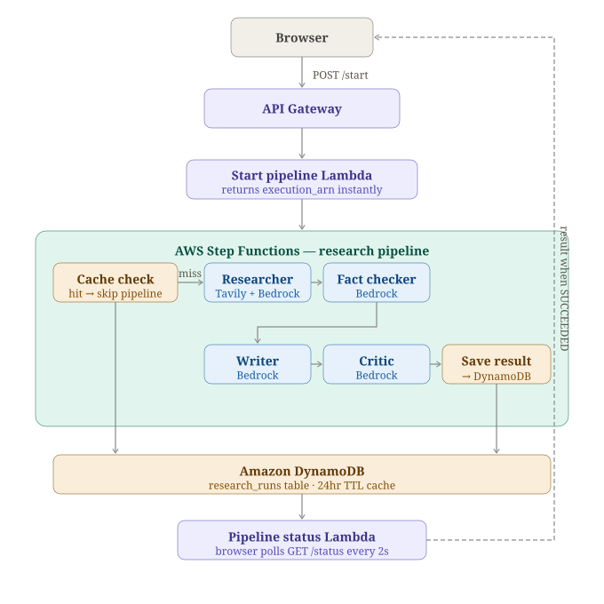

# The Research Desk — AI Multi-Agent Research Pipeline

A distributed multi-agent research pipeline built from scratch on AWS — no LangChain, no agent frameworks. Four specialized AI agents collaborate to research, fact-check, write, and critique any topic, orchestrated by AWS Step Functions.

**[Live Demo](https://d3q01wfwtbi754.cloudfront.net)**

---

## What It Does

Submit any topic. Four AI agents handle the rest:

| Agent | Role |
|---|---|
| **Researcher** | Searches the web via Tavily, extracts key facts and credible sources |
| **Fact Checker** | Validates claims, assigns confidence scores, flags unverifiable assertions |
| **Writer** | Produces a structured markdown report from verified facts |
| **Critic** | Reviews the report for clarity, depth, and usefulness |

The full pipeline runs in ~35 seconds. Repeat queries return instantly from DynamoDB cache (~2 seconds).

---

## Architecture



```
Browser
  ↓ POST /start
API Gateway → Start Pipeline Lambda (returns execution_arn instantly)
  ↓ StartExecution
AWS Step Functions
  ├── Cache Check Lambda → DynamoDB
  │     ├── Cache HIT  → Return instantly (~2s)
  │     └── Cache MISS → Continue pipeline
  ├── Researcher Lambda → Tavily Search API → Amazon Bedrock
  ├── Fact Checker Lambda → Amazon Bedrock
  ├── Writer Lambda → Amazon Bedrock
  ├── Critic Lambda → Amazon Bedrock
  └── Save Result Lambda → DynamoDB
  ↓
Amazon DynamoDB (research_runs table · 24hr TTL cache)
  ↓
Pipeline Status Lambda
  ↓
Browser polls GET /status every 2s → renders result when SUCCEEDED
```

---

## AWS Services

| Service | Purpose |
|---|---|
| **AWS Lambda** | Each agent runs as an independent serverless function |
| **AWS Step Functions** | Orchestrates the 4-agent pipeline with branching (Choice state) and retry logic |
| **Amazon API Gateway** | Exposes HTTP endpoints for pipeline start and status polling |
| **Amazon Bedrock** | Managed LLM inference (Claude Haiku 4.5) |
| **Amazon DynamoDB** | Persists research results with 24-hour TTL cache |
| **Amazon CloudWatch** | JSON-structured logging across all Lambda functions |
| **AWS IAM** | Least-privilege roles for Lambda and Step Functions |

---

## Why No LangChain?

Deliberately avoided agent frameworks to understand the underlying mechanics:

- **Tool calling** — implemented directly via boto3 + Tavily SDK
- **Agent orchestration** — AWS Step Functions state machine, not an in-process loop
- **State passing** — explicit InputPath/ResultPath mappings between agents
- **Fault tolerance** — Step Functions retry policies, not try/catch blocks

This means the system is distributed (each agent is independently deployable), observable (CloudWatch logs per agent), and production-scalable from day one.

---

## Tech Stack

**Backend:** Python 3.12, boto3, Pydantic, Tavily Python SDK

**AWS:** Lambda, Step Functions, API Gateway, Bedrock, DynamoDB, CloudWatch, IAM

**Frontend:** React 19, Vite, react-markdown

**Testing:** pytest, pytest-mock (75+ unit tests, all agents mocked independently)

---

## Project Structure

```
src/
├── agents/          # Lambda handlers for each agent + pipeline orchestration
├── utils/           # Shared clients: Bedrock, Tavily, DynamoDB, config, logger
└── prompts/         # Prompt templates for each agent
infra/
└── research_pipeline.json   # Step Functions state machine definition
frontend/
└── src/             # React app with editorial design
docs/
└── architecture.svg          # System architecture diagram
tests/               # Unit tests for all agents and utilities
```

---

## Design Decisions Worth Noting

**Cache-aside with TTL** — Before running the pipeline, a dedicated Lambda checks DynamoDB for a recent result (< 24 hours). Cache hits skip all LLM calls entirely, returning in ~2 seconds instead of ~35.

**Handler Factory Pattern** — A single `handler_factory.py` creates Lambda handlers for any agent, eliminating boilerplate across 6+ handlers. Each agent's handler is 3 lines.

**Polling over WebSockets** — The frontend polls `/status` every 2 seconds instead of maintaining a persistent WebSocket connection — simpler infrastructure, sufficient for this use case, and lets us show live per-agent progress without additional AWS services.

**Critic as internal quality signal** — The Critic's score is not shown to users. Instead, its `critique_summary` and `suggested_improvements` surface as "Ways to go deeper" — additive context, not a judgment on the pipeline's output quality.

**Step Functions Choice state** — A dedicated CacheCheck Lambda + Choice state short-circuits the pipeline on cache hits, avoiding unnecessary LLM calls. This is the most cost-efficient path for repeat queries.

---

## Running Locally

```bash
# Clone and install
git clone https://github.com/mankirat2601/ai-research-assistant
cd ai-research-assistant
python3 -m venv venv && source venv/bin/activate
pip install -r requirements.txt

# Configure environment
cp .env.example .env
# Fill in: AWS credentials, TAVILY_API_KEY, BEDROCK_MODEL_ID, STATE_MACHINE_ARN

# Run tests
make test

# Frontend
cd frontend && npm install && npm run dev
```

---

## Future Improvements

- **Reflection loop** — Critic feeds back into Writer for a second draft before returning to user (currently the Critic is a single-pass reviewer)
- **Streaming** — Stream Writer output token-by-token to the frontend instead of waiting for the full response
- **Multi-topic comparison** — Run the pipeline on two topics in parallel using Step Functions parallel state
- **Typeahead search** — Query DynamoDB for past topics as user types, with instant cache retrieval on selection
